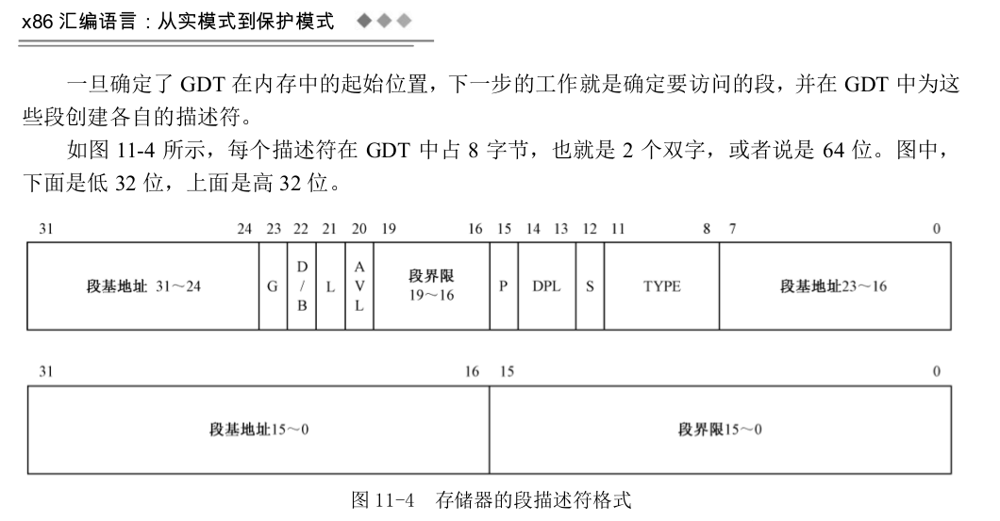
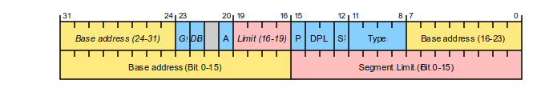
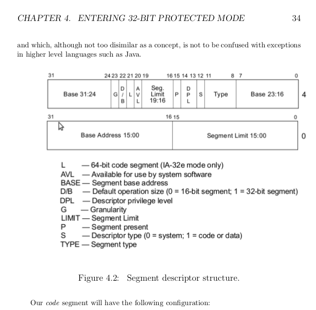
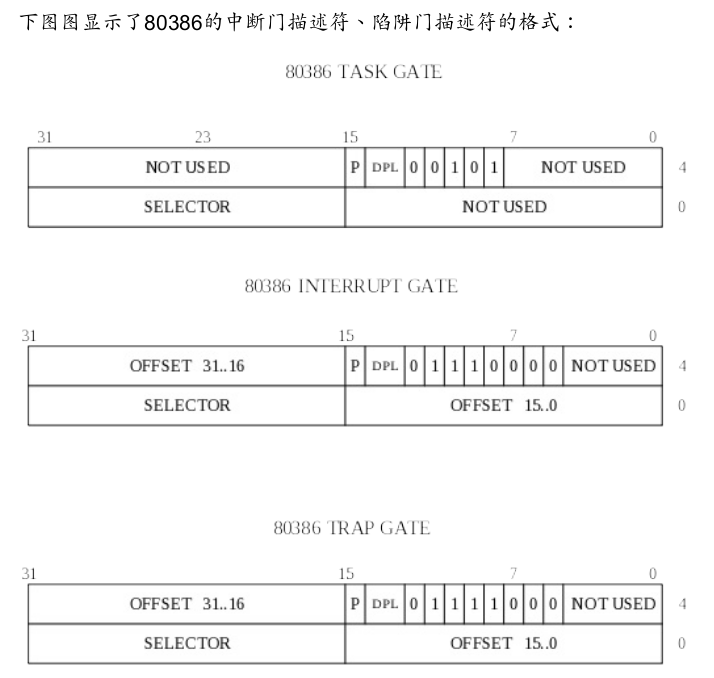

### RiOS doc

 Copyright (C) 2018 邱日

----------------------------------

##### Here are some notes in my kernel development.

### GDT:

https://en.wikipedia.org/wiki/Global_Descriptor_Table

##### Here are some materials about GDT from 《Writing a Simple Operating System —from Scratch》by Nick Blundell.

• Base: 0x0
• Limit: 0xfffff
• Present: 1, since segment is present in memory - used for virtual memory
• Privilige: 0, ring 0 is the highest privilige
• Descriptor type: 1 for code or data segment, 0 is used for traps
• Type:
– Code: 1 for code, since this is a code segment
– Conforming: 0, by not corming it means code in a segment with a lower
privilege may not call code in this segment - this a key to memory protection
– Readable: 1, 1 if readible, 0 if execute-only. Readible allows us to read
constants defined in the code.
– Accessed: 0 This is often used for debugging and virtual memory techniques,
since the CPU sets the bit when it accesses the segment
• Other flags

– Granularity: 1, if set, this multiplies our limit by 4 K (i.e. 16*16*16), so our
0xfffff would become 0xfffff000 (i.e. shift 3 hex digits to the left), allowing
our segment to span 4 Gb of memory
– 32-bit default: 1, since our segment will hold 32-bit code, otherwise we’d use
0 for 16-bit code. This actually sets the default data unit size for operations
(e.g. push 0x4 would expand to a 32-bit number ,etc.)
– 64-bit code segment: 0, unused on 32-bit processor
– AVL: 0, We can set this for our own uses (e.g. debugging) but we will not
use it

Since we are using a simple flat model, with two overlapping code and data segments,
the data segment will be identical but for the type flags:
• Code: 0 for data
• Expand down: 0 . This allows the segment to expand down - TODO
explain this
• Writable: 1. This allows the data segment to be written to, otherwise
it would be read only
• Accessed: 0 This is often used for debugging and virtual memory
techniques, since the CPU sets the bit when it accesses the segment

-----------------------------------------------------------------

### Interrupt Gate and Trap Gate:

https://www.gitbook.com/book/chyyuu/simple_os_book/details  《simple_os_book》P92  

Gate Descriptors　＝> 

-  1.interrupt-gate descriptpr
-  2.Trap-gate descriptor
-  3.Task-gate descriptor 
-  4.Call-gate descriptor