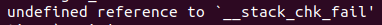
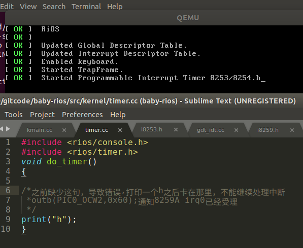
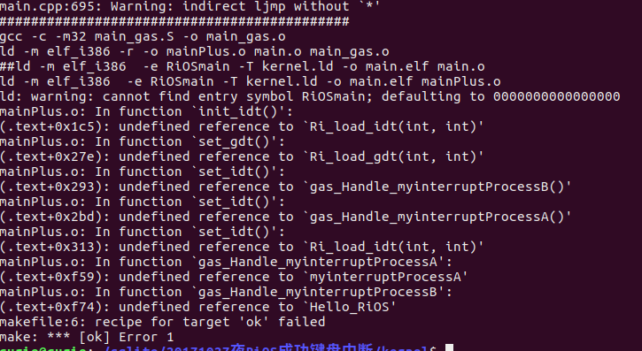
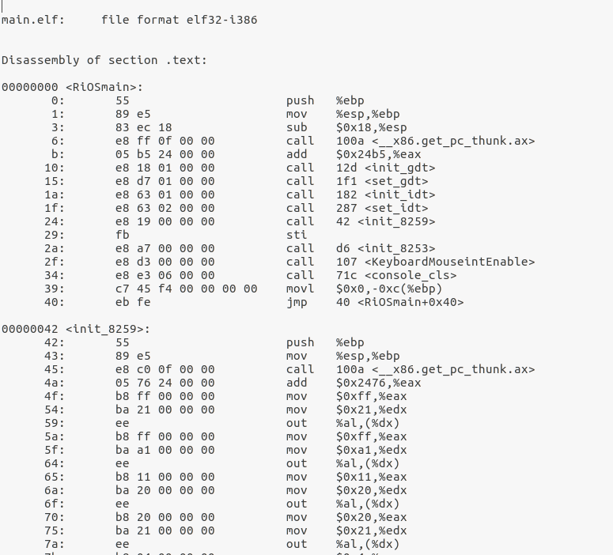
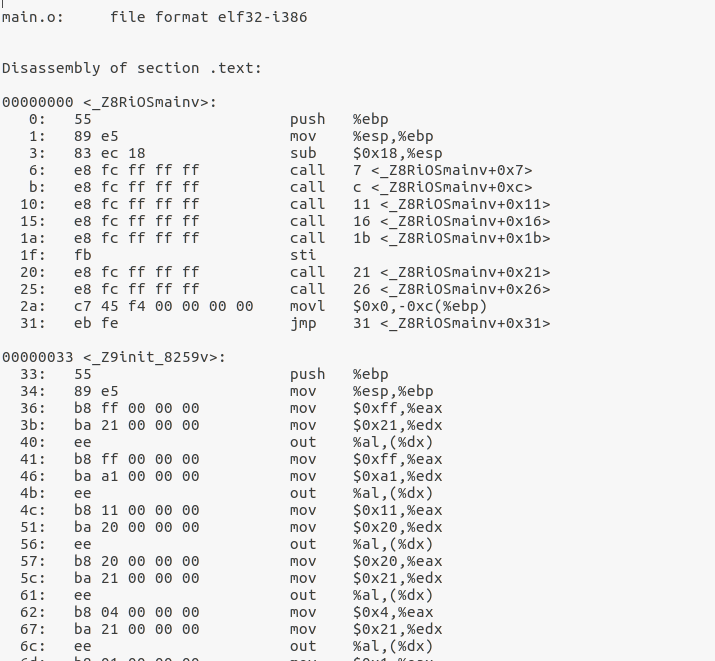

------------------------

#### bug01描述：



 undefined reference to `__stack_chk_fail'

解决方法：在编译时，在CFLAGS后面加上-fno-stack-protector

-fno-stack-protector 

------------------------

####  bug02描述：

```
gcc: fatal error: stdio.h: No such file or directory
```

解决方法：可能是不小心吧环境污染了，导致stdio.h都不能包括进来，根据https://stackoverflow.com/questions/19580758/gcc-fatal-error-stdio-h-no-such-file-or-directory解决。

```shell
sudo apt-get install libc6-dev
```

https://www.ppkao.com/shiti/7403389/

------------------------

#### bug03描述：

在qemu虚拟机中没问题，按一个键打印一个字符，但到了实体机按一次打印两个相同字符

原理：

​	按一个键打印两个字符，因为一次是Make code，一次是Break Code.键盘的扫描码Scan Code，通码Make code，断码Break Code 用户按键盘上的字母，硬件底层会产生对应的Scan Code，而且是按下那一刻产生一个通码Make code，释放的时候产生一个断码Break code。即你从按下一个键盘上的字母，到手松开，实际上对应着一个通码Make Code和一个断码Break Code，两者概念上都属于扫描码Scan Code。

解决方法：判断键盘状态

------------------------

#### bug04描述：

中断只能执行一次

解决方案：在中断处理函数中通过in out指令告知8259A中断已经被处理，不然将会一直卡死在那里，不会受理下一次中断



解决方案：方法一是给8259A发EOI信号，即为outb(PIC0_OCW2,0x60),即outb(0x20,0x60);方法二是采用自动EOI方式，目前RiOS采用后者，一下这两句分别给主片和从片设为自动EOI模式．

```
outb_wait(0x20 + 1, 0x3); // Auto EOI in 8086/88 mode
outb_wait(0xa0 + 1, 0x3); // Auto EOI in 8086/88 mode
```

----------------------

#### bug05描述：

​	这个问题可以追溯到上学期做第一次操作系统实验的时候，当时找到了原因，但没有找到解决问题的方法，导致我一直只能用汇编和Ｃ，无法使用C++,现在这个问题已经解决．

​	问题的背景是我采用C语言开发本系统的过程中，代码没有问题，编译通过可以正常运行的情况下，我将main.c改为main.cpp.当然Makefile里也作相应变化比如用g++来编译main.cpp什么的。但是，却发现一些通过标号调用汇编代码的地方全不行了，报错undefined.



一直找不到原因，我将编译后的机器码反汇编成.asm文件找原因

Linux命令：

objdump -S -D main.elf >main.asm

  

之前编译正常.c文件时的编译结果

可以看到，我的函数名RiOSmain和init_8259在编译之后是保留原来的字的。

Linux命令：

g++  -nostdinc -I.  -fpermissive -fno-stack-protector -c main.cpp -m32 -o main.o

objdump -S main.o >main.asm

 

编译.cpp文件时的结果

此时我惊讶地发现，在gcc或g++对.cpp文件编译时，原来RiOSmain的函数名变成了_Z数字RiOSmainv ，即gcc是这样处理的函数到标号的映射是标号：_Z数字函数名v　这样根据名字去链接必然失败．

解决方法：将C++源程序保存为.cc文件，在头文件的把函数声明包在extern "c"{}之中，这样Ｃ++的函数编译后就能和C编译后的函数兼容

```c++
/*this is hello.h*/
#ifdef __cplusplus
extern "C" {
#endif /* __cplusplus */

void hello_cplusplus();

#ifdef __cplusplus
}
#endif /* __cplusplus */
```

extern "C"的主要作用就是为了能够正确实现C++代码调用其他C语言代码。加上extern "C"后，会指示编译器这部分代码按C语言的进行编译，而不是C++的。由于C++支持函数重载，因此编译器编译函数的过程中会将函数的参数类型也加到编译后的代码中，而不仅仅是函数名；而C语言并不支持函数重载，因此编译C语言代码的函数时不会带上函数的参数类型，一般只包括函数名。

C++ undefined 调用不了函数的关键

extern "C"的意思，是让C++编译器（不是C编译器，而且是编译阶段，不是链接阶段）在编译C++代码时，为被extern “C”所修饰的函数在符号表中按C语言方式产生符号名（比如前面的add），而不是按C++那样的增加了参数类型和数目信息的名称（_Z3addii）。

展开来细说，就是：

如果是C调用C++函数，在C++一侧对函数声明加了extern "C"后符号表内就是add这样的名称，C程序就能正常找到add来调用；如果是C++调用C函数，在C++一侧在声明这个外部函数时，加上extern "C"后，C++产生的obj文件符号表内就也是标记为它需要一个名为add的外部函数，这样配合C库，就一切都好。

####  bug06描述：

不断重启

原因：把ＧＤＴ的地方覆盖了，引发triple fault

解决方案：先设置好ＧＤＴ再去设置ＩＤＴ