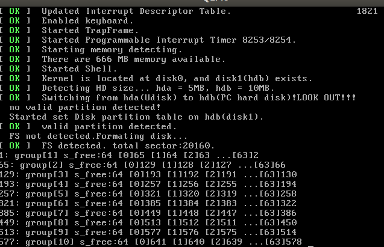
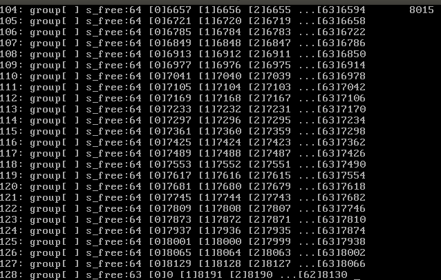
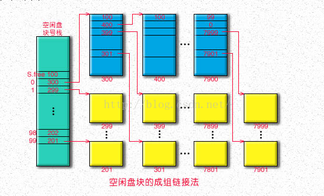

## design of file system

-------------------

采用成组链接管理空闲块.

### 参数设定
- 目前磁盘10MB, 
- 磁盘前一部分是一些控制信息，我们设数据区前8MB放除了专用块之外的空闲块,
  8*1024*2=16384sectors,设数据区(专用块)一共8*1024块，
- 64块划分成一组,一共128块,专用块和普通的空闲块并没有什么本质上的不同．

### 初始化
- 初始化时，若之前未初始化，先指定*第一组*的第一块为专用块，把此块复制到内存专用块中;
  如果已经初始化，从磁盘加载超级块到内存，得到专用块的块号．
- 所有组的第一块相互链接，类似一个顺序表，这些组的第一块第一项存空闲块计数，第二项存下一块的块号，
  当专用块用完时，它就指定它的下一块是专用块，并在超级块中更改专用块的块号．
- 组号写代码时从１开始编号

开始的几组

末尾的几组


注意，最后一组空闲块要少一个



### 目录

如何得知一个目录文件里有多少个目录项？
目录文件的inode中记录有大小i_size,由目录文件的inode中的i_size得到目录文件大小
而struct dir_entry目录项的大小是固定的，由i_size除以sizeof(dir_entry)可知有几个目录项目．

### 间址

```
/*
 * zone[0~6]:	direct block 
 * zone[7]:	single indirect block
 * zone[8]:	double indirect block 
 * zone[9]:	trible indirect block
 */
```

---------------

zone[0~6]直接寻址: 
	每个块2扇区,7*(2*512)=7168B = 7kB
 length: 0~7*(2*512)B              [0,7168] B
 sector:length/512 	[1,7*2]

zone[7] 一次间址: 
	u16 zone[] u16 => 2B , 一个区可以存(2*512)/2=512 个扇区号,
	512 * (512*2) = 512kB.
 length: 7*(2*512)+1 ~ 7*(2*512)+512*(512*2) 
        [7169,531456]  B
 sector: ⌈length/512⌉    [7*2+1,7*2+512*2]
 	[15,1038]      

zone[8] 两次间址: 512 * 512 * (512 * 2)= 256 MB 
 length:  7*(2*512)+512*(512*2)+1~7*(2*512)+512*(512*2)+512*512*(512*2)
 	[531457,268966912] B
 sector:⌈length/512⌉     [7*2+512*2+1,]	
 	[1039,525326]

zone[9] 三次间址: 512 * 512 * 512 * (512 * 2) = 128 GB 
 length: 7*(2*512)+512*(512*2)+512*512*(512*2)+1 ~ \
 		7*(2*512)+512*(512*2)+512*512*(512*2)+512 * 512 * 512 * (512 * 2)
 	[268966913,137707920384] B

### [Linux ext2](https://www.cnblogs.com/biyeymyhjob/archive/2012/07/26/2609649.html)


### kprintf 或 cat命令时显示文件速度的问题
这倒不是bug,只是性能上的原因,原来我若cat打印一个文件的内容到屏幕上,我先malloc一个这么大的内存,
然后把文件内容复制到内存空间,然后kprintf("%s",str);但是发现显示速度极其慢,也不知道为什么,
我在反复调试中发现原因在于这个str过长,虽然功能正确,但速度太慢了,若是把它分割为几段依次输出,
速度就会提高很多.