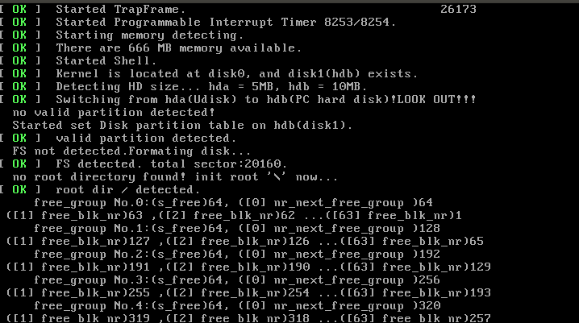
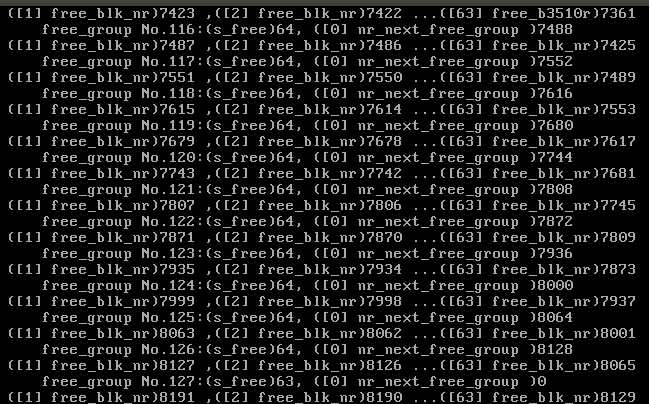
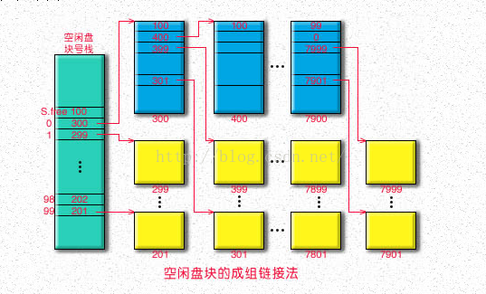

## design of file system

-------------------

采用成组链接管理空闲块.

### 参数设定
- 目前磁盘10MB, 
- 磁盘前一部分是一些控制信息，我们设数据区前8MB放除了专用块之外的空闲块,
  8*1024*2=16384sectors,设数据区(专用块)一共8*1024块，
- 64块划分成一组,一共128块,专用块和普通的空闲块并没有什么本质上的不同．

### 初始化
- 初始化时，若之前未初始化，先指定*第一组*的第一块为专用块，把此块复制到内存专用块中;
  如果已经初始化，从磁盘加载超级块到内存，得到专用块的块号．
- 所有组的第一块相互链接，类似一个顺序表，这些组的第一块第一项存空闲块计数，第二项存下一块的块号，
  当专用块用完时，它就指定它的下一块是专用块，并在超级块中更改专用块的块号．
- 组号写代码时从０开始编号，０到１２７

开始的几组

末尾的几组

注意，最后一组空闲块要少一个

### 目录

如何得知一个目录文件里有多少个目录项？
目录文件的inode中记录有大小i_size,由目录文件的inode中的i_size得到目录文件大小
而struct dir_entry目录项的大小是固定的，由i_size除以sizeof(dir_entry)可知有几个目录项目．

