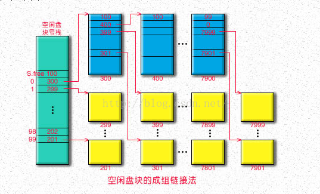

RiOS kernel
============

##### Copyright (C) 2018 Frank Curie (邱日)

------------------

19215116 邱日　指导老师:姜海燕

[TOC]

#####  摘要　

​	本着加深对操作系统理论知识的理解，增强动手能力的原则，我选择在物理机器上实现一个真实的文件系统．本套程序具有很强的系统性，虽然是做一个文件系统，但涉及操作系统课本的大部分章节，在实现上，首先我利用grub加载我的内核镜像，然后设置函数栈大小，段的管理上设置好gdt表，初始化idt表，采用连续内存分配．整个内核具体涉及到处理器管理，中断和异常的处理，系统调用的实现；涉及存储管理，基于连续空间分配和回收存储空间；涉及设备管理，编写了键盘驱动、字符显示设备的驱动、ATA硬盘驱动，内核能够操纵屏幕键盘和读写硬盘；在文件系统的实现上，对inode索引节点采用基于位图的空间分配回收，对数据区采用基于成组链接的磁盘空间分配与回收，采用多级目录，三级索引．

##### 关键字

​	位图、成组链接、多级索引、文件系统


----------------------

## 一、目的及意义

​	在现代计算机系统中,要用到大量的程序和数据,因内存容量有限,且不能长期保存,
故而平时总是把它们以文件的形式存放在外存中,需要时再随时将它们调入内存。如果由用
户直接管理外存上的文件,不仅要求用户熟悉外存特性,了解各种文件的属性,以及它们在
外存上的位置,而且在多用户环境下,还必须能保持数据的安全性和一致性。显然,这是用
户所不能胜任、也不愿意承担的工作。于是,取而代之的便是在操作系统中又增加了文件管
理功能,即构成一个文件系统,负责管理在外存上的文件,并把对文件的存取、共享和保护
等手段提供给用户。这不仅方便了用户,保证了文件的安全性,还可有效地提高系统资源的
利用率。
​	计算机操作系统是计算机中的关键技术,它的设计与实现体现了程序设计与软件工程的
精髓。计算机操作系统原理课程是计算机科学与技术专业的核心课程,课程设计不仅可使我
们巩固理论学习的概念、原理、设计及算法,同时也可以让我们感知软件开发所应具有的系
统结构设计和软件工程素养。此次课程设计让我们了解了文件管理的功能和任务,理解文件
系统组成和特点,熟悉文件系统的访问和操作。实验要求用高级语言编写和调试一个简单的
模拟文件管理程序。加深理解有关盘块的分配与回收、目录管理等的具体实施策略。

----------------------

## 二、课程设计思路及完成任务与功能说明

### 2_1 Grub的安装

安装Grub到U盘上

```shell
df -h # U盘是/dev/sdb
sudo mount /dev/sdb /mnt #挂载U盘到/mnt
mkdir /mnt/boot 
sudo grub-install --root-directory=/mnt /dev/sdb
#出现提示错误信息 grub-install: error: will not proceed with blocklists.
#不管他，强制 块列表是不可信赖的,不推荐使用。问题依旧,输入一下指令,强制写入。
sudo grub-install --force --root-directory=/mnt /dev/sdb
```


​			grub安装到Ｕ盘过程

复制menu.lst到u盘grub下,根据实际情况修改grub.cfg。

```bash
sudo cp ~/laji/build/isofiles/boot/kernel.bin /media/curie/73e0a858-61b7-465b-8d96-608d156ce93e/boot
sudo cp ~/laji/build/isofiles/boot/grub/grub.cfg /media/curie/73e0a858-61b7-465b-8d96-608d156ce93e/boot/grub

```

把grub.cfg和内核镜像放到相应位置，bios设U盘为第一启动项重启


### 2_2 GDT ＆ IDT的结构

IDT Gate Descriptors


GDTR 寄存器用来存放全局描述符表付32位线性地址和16位表长度值

###　2_3 中断门和陷阱门


段描述符


### 2_4 设备驱动

- SCSI硬盘是采用SCSI接口的硬盘，SCSI是Small Computer System Interface（小型计算机系统接口）的缩写，使用50针接口，外观和普通硬盘接口有些相似。SCSI硬盘和普通IDE硬盘相比有很多优点：接口速度快，并且由于主要用于服务器，因此硬盘本身的性能也比较高，硬盘转速快，缓存容量大，CPU占用率低，扩展性远优于IDE硬盘，并且支持热插拔。
- IDE即Integrated Drive Electronics，它的本意是指把控制器与盘体集成在一起的硬盘驱动器，IDE是表示硬盘的传输接口。我们常说的IDE接口，也叫ATA（Advanced Technology Attachment）接口，现在PC机使用的硬盘大多数都是IDE兼容的，只需用一根电缆将它们与主板或接口卡连起来就可以了。


- U盘是SCSI,是sdb


### 2_5 硬盘分区表(文献资料)

https://wiki.osdev.org/MBR_(x86)　分区表

- It is important to remember that the partition table entries are **not** aligned on 32-bit boundaries.

| Offset | Size (bytes)                             | Description                              |
| ------ | ---------------------------------------- | ---------------------------------------- |
| 0      | 436 (to 446, if you need a little extra) | MBR **Bootstrap** (flat binary executable code) |
| 0x1b4  | 10                                       | Optional "unique" disk ID1               |
| 0x1be  | 64                                       | MBR **Partition Table**, with 4 entries (below) |
| 0x1be  | 16                                       | First partition table entry              |
| 0x1ce  | 16                                       | Second partition table entry             |
| 0x1de  | 16                                       | Third partition table entry              |
| 0x1ee  | 16                                       | Fourth partition table entry             |
| 0x1fe  | 2                                        | (0x55, 0xAA) "Valid bootsector" signature bytes |

http://www.gotothings.com/unix/disk-partition-table.htm

Disk Partition Table

The partition table information is usually written in the first sector (512 bytes) of the device, which is therefore called master boot sector (MBS). The MS-DOS master boot sector begins with a JUMP instruction (three bytes). The disk parameters follow (offset 0x003), and then there is the DOS kernel loader (at offset 0x03E). The master boot sector is terminated by the magic number, 0xAA55, for the bios in the final two bytes (offset 0x1FE).

A hard disk is more complicated than a floppy, because it has partitions. However the BIOS boots from a hard disk as if it were a floppy. Therefore the first sector (master boot record) must have the structure of a MBS, ie, the first instruction that is executed is at offset 0x000, and there must be the magic number 0xAA55 at offset 0x1FE. The master boot record contains the information about the dist partition. More precisely each partition is described by 16 bytes,

- 0x00: boof-flag (0 = inactive, 0x80 = active)
- 0x01: start cyl / head / sect: starting cylinder, head, sector of the partition
- 0x04: system code (0x80 linux, ...)
- 0x05: end cyl / head / sect
- 0x08: relative sector number of start sector
- 0x0c: number of sectors in the partition

The first partition descriptor is at offset 0x1BE. The second at 0x1CE, the third at 0x1DE, and the fourth at 0x1EE.

### 2_4 成组链接

​	本次操作系统课程设计，用位示图管理inode区，采用成组链接法管理数据区．在 UNIX 系统中,将空闲块分成若干组,每 100 个空闲块为一组,每组的第一空闲块登记了下一组空闲块的物理盘块号和空闲块总数。如果一个组的第二个空闲块号等于 0,则有特殊的含义,意味着该组是最后一组,即无下一个空闲块。分配空闲块的时候,从前往后分配,先从第一组开始分配,第一组空闲的 100 块分完了,才进入第二组。释放空闲块的时候正好相反,从后往前分配,先将释放的空闲块放到第一组,第一组满了,在第一组前再开辟一组,之前的第一组变成第二组。





----------------------

## 三、裸机硬件部件

### 3_1.门描述符　Gate_descriptor

```C++
#pragma pack(1)
struct GATE_DESCRPTER{
	u16 offset_lowerbits		:16; // offset bits 0..15
	u16 selector			    :16; // a code segment selector in GDT or LDT
	u8  zero			        :8 ; // unused,set to 0     
	u8  seg_type			:4 ; // type and attributes, total u8 type_attr;
	u8  storage			    :1 ; // set to 0 for interrupt and trap gates 
	u8  descr_privilege_level   :2 ;
	u8  present			        :1 ;
	u16	offset_higherbits	:16; // offset bits 16..31	
};
#pragma pack()
```

这里门描述符应该逐字节紧凑排列，不能因编译器字节对齐而使结构体大小膨胀

### 3_2.异常和中断


- http://www.osdever.net/bkerndev/Docs/isrs.htm

- The first 32 entries in the IDT correspond to Exceptions that can possibly be generated by the processor, and therefore need to be handled. Some exceptions will push another value onto the stack: an Error Code value which is specific to the exception caused.

------------------------

### 3_3.物理磁盘

#### 3_3_1 物理容量设定

​	为方便代码和相关资料的传输，磁盘不宜过大，但也不能过小，否则体现不出文件系统的功能．目前磁盘采用10MB，磁盘前一部分是一些控制信息,有引导扇区和inode位图和inode区等等．考虑到这些也占空间，故设数据区8MB.

​	我们的策略是:inode的管理采用位图法，空闲数据区磁盘空间的管理采用成组链接的方法．

​	我们设数据区前8MB放除了专用块之外的空闲块,8* 1024 * 2=16384sectors,设数据区(专用块)一共8*1024块，64块划分成一组,一共128块,专用块和普通的空闲块并没有什么本质上的不同．

#### 3_3_2 磁盘格式化

　　初始化时，若之前未初始化，先指定*第一组*的第一块为专用块，把此块复制到内存专用块中;如果已经初始化，从磁盘加载超级块到内存，得到专用块的块号．所有组的第一块相互链接，初始化时类似一个顺序表，这些组的第一块第一项存空闲块计数，第二项存下一块的块号，当专用块用完时，它就指定它的下一块是专用块，并在超级块中更改专用块的块号．所有组的第一块相互链接，类似一个顺序表，这些组的第一块第一项存空闲块计数，第二项存下一块的块号，当专用块用完时，它就指定它的下一块是专用块，并在超级块中更改专用块的块号．组号写代码时从１开始编号．

​	磁盘初始化时即格式化磁盘，若采用在qemu虚拟机上测试的方法，则需要利用bochs的工具来制作一个10MB的空白磁盘镜像，其方法是，在Linux终端输入bximage,然后依次选择输入hd, flat, 10, rios_hd.img就能得到一个名为rios_hd.img的10MB大小磁盘镜像;若在真实的物理机器上测试，格式化磁盘将会在函数init_hd中发生，清空磁盘，此举有一定的危险性，如果想要进行下去，请务必确认您的电脑中没有重要资料，否则将在格式化时全部清空． 

####  3_3_3 目录项的确定

​	如何得知一个目录文件里有多少个目录项？目录文件的inode中记录有大小i_size,由目录文件的inode中的i_size得到目录文件大小.而struct dir_entry目录项的大小是固定的，由i_size除以 sizeof(dir_entry)可知有几个目录项目．


----------------------

## 四、通用数据结构设计（包括基础操作）

### 4_1.内存超级块结构        superblock

```C++
struct super_block{
	u16 s_ninodes;
	u16 s_capacity_blks;		/*capacity count in blocks*/
	u16 s_startsect;
	u16 s_zone_bitmap_blks;		/*according to Prof Jiang,we will not use this policy (data block bitmap) anymore.*/
	u16 s_inode_bitmap_blks;	/*num of blks that bitmap takes up*/
	u16 s_inode_blks;
	u16 s_firstdatazone;		/*first data zone locates at which sector*/
	u16 s_specific_blk_nr;	    /*free space management:grouping, the specific block's block number,coounting from 1*/
/*成组链接专用块对应磁盘上的盘块号(从1计数)*/
	u16 s_magic;		    	/*ri_fs magic:0x88*/
/*These are only in memeory*/
/*code here.addtional info in memory*/
};
```


### 4_2.磁盘超级块结构       d_superblock

```C++
struct d_super_block
{
	u16 s_ninodes;
	u16 s_capacity_blks;		/*capacity count in blocks*/
	u16 s_startsect;		/*超级块的起始扇区，sector0为boot sector,故超级块从1开始*/
	u16 s_zone_bitmap_blks;		/*according to Prof Jiang,we will not use this policy (data block bitmap) anymore.*/
	u16 s_inode_bitmap_blks;	/*num of blks that bitmap takes up*/
	u16 s_inode_blks;
	u16 s_firstdatazone;
	u16 s_specific_blk_nr_group;	/*成组链接专用块对应磁盘上的组号*/
	u16 s_magic;			/*ri_fs magic:0x88*/
};
```

超级块的s_magic为rifs文件系统的魔幻数字，这里我设其为0x88,开机时若在磁盘上超级块对应位置探测到0x88,系统就认为已经安装rifs文件系统．

### 4_3.内存中inode结构    m_inode

```C++
struct m_inode
{
	u8 i_mode;			/*file type(dir/normal) and attribute(rwx)*/
	u8 i_size;
	u8 i_uid;			/*user id*/
	u8 i_gid;			/*group id*/
	u8 i_nlinks;			/*num of files that link to it*/
	u8 padding0;
	u32 i_creat_time;	
	u16 i_zone[10];
	u16 i_ino;			/*inode id号　(bitmap)*/
	u32 padding1[8];		/*占位　8*32个字节*/
/* ok,let's make sizeof(d_inode) exactly equal to 64,that's 512bits,
 * a sector can put exactly 8 of d_inode.
 * if we attemp to extend the m_inode and d_inode,make sure that
 * they are in sync with each other,and adjust the fields and paddings
 * without changing the sizeof(d_inode)
 */
/*请控制好d_inode的大小以及与m_inode同步性．这里设置几个padding的意义在于占位，
 *我把d_inode 的大小控制在8*6+32+16*10+16+32*8=512 bits,这样一个扇区512*8=4096bits,
 *正好可以放８个d_inode,尽量避免跨扇区操作inode;
 */	
/*
 * zone[0~6]:	direct block 
 * zone[7]:	single indirect block
 * zone[8]:	double indirect block 
 * zone[9]:	trible indirect block
 */	
/*These are only in memeory*/
	u32 i_access_time;
	u8 i_mount;
	u8 i_dev;			/*hd0 or hd1*/
	u8 i_dirty;
	u8 i_updated;
	u8 i_count;			/*引用数*/
	struct task_struct *i_wait;	/*not implemented yet*/
}__attribute__((packed));		/*一定要加，不然字节对不齐，会多用空间*/
```


### 4_4.磁盘inode结构        d_inode

```C++
struct d_inode{
	u8 i_mode;			   /*file type(dir/normal) and attribute(rwx)*/
	u8 i_size;			   /*file size that counts in bytes*/
	u8 i_uid;			   /*user id*/
	u8 i_gid;			   /*group id*/
	u8 i_nlinks;		   /*num of files that link to it*/
	u8 padding0;
	u32 i_creat_time;	   /*time of creating this file*/
	u16 i_zone[10];		   /*三次索引*/
	u16 i_ino;			   /*inode id号*/
	u32 padding1[8];
}__attribute__((packed));  /*一定要加，不然字节对不齐，会多用空间*/
```

​	磁盘inode和内存inode的数据结构上相似，即内容上磁盘inode结构是内存inode结构的子集，内存inode不但要保存磁盘inode的所有信息，还要保存进程和系统运行中的相关信息．为避免操纵磁盘inode时跨扇区操作，这里我严格控制d_inode结构体的大小，为512bits，即64B,而一个扇区512B,恰好可以放8个磁盘inode,这里__attribute__((packed))很重要，如果不加的话，编译器为了字节对齐，一个结构体将使用多于64B的空间，这样将导致inode的存放很碎，操作出问题．机构体里的padding主要是为了占位，凑到恰好64B,日后若扩展d_inode时，就减少padding的数量，然后加上要增加的新项，保持sizeof(struct d_inode)不变．


### 4_5.目录项结构              dir_entry

```C++
struct dir_entry{
	u32 inode;
	u8 name[MAX_NAME_LEN];
}__attribute__((packed));
```

这里目录项对应目录中的一条记录的结构，记录两项内容，一是inode号，二是文件或目录名字．


### 4_6.文件结构                  file

```c++
struct file
{
	u8 f_mode;			        /*文件读写模式及权限管理*/
	u8 f_flags;
	u16 f_count;			    /*file引用次数*/
	struct m_inode * f_inode;	/*指向活动inode表中文件的inode*/
	u32 f_pos;
};
```


### 4_7.进程控制块              task_struct

```c++
struct task_struct{
	u8 gid;
	u8 uid;
	struct m_inode * pwd;
	struct m_inode * root;
	struct file * filp[NR_OPEN];	/*　进程表项　*/
/* this is user-wide file table */	
};
```

进程PCB记录当前的组id和用户id,内存inode指针pwd指向当前目录的inode,内存inode指针指向当前根目录的inode,进程表项struct file * filp[NR_OPEN],为用户打开文件表．


### 4_8.活动inode表           active_inode_table

```c++
struct active_inode_table{
	struct m_inode inode_table[MAX_ACTIVE_INODE];
};
```

rifs文件系统中有三个重要的表:
(1)系统打开文件表:　

​	struct file file_table[NR_FILE];系统中仅有一份
(2)用户(进程)打开文件表:　

​	struct file * filp[NR_OPEN];包含于进程PCB之中，每个进程有一份

(3)活动inode表:	

```c++
struct active_inode_table{
	struct m_inode inode_table[MAX_ACTIVE_INODE];
};
```

这三个表中，活动inode表从磁盘上拷贝inode,另外由于表中结构体是struct m_inode，还存一些系统运行时的相关信息，比如内存m_inode中的i_count即被引用次数．系统打开文件表file_table其表中项的结构是file,file中包含指向m_inode的指针，即指向活动inode表的表项.用户打开文件表filp[NR_OPEN],其中表项的结构是* file,即文件的指针.文件描述符fd是filp[..]指针数组的index下标,fd可以看做file索引的索引．


### 4_9.磁盘块联合体 　　free_space_grouping_head

(基于空闲磁盘空间的成组链接方式)

```c++
union free_space_grouping_head {/*成组链接法，各组空闲块的头*/
	u16 bytes[512] = {0};/*占坑位　2 sectors*/
	struct {
		u16 s_free;
		u16 s_free_blk_nr[BLKS_PER_GROUP];/*[64]*/
	};
/*s_free_blk_nr[0] is next free group's nr*/
};
```

在rifs中，对于数据区，空闲磁盘空间管理采用成组链接方式，一个磁盘数据块有两个扇区，这里采用了联合体而不是结构体，意义主要在于占位，使得一个这样的联合体恰好1024B即两个扇区即一个数据块的大小，若此磁盘块为组里第一块，则它要记录整个组空闲块的信息，第一项s_free记录本组共有几个空闲块，其后的表项记录本组所有空闲块的块号，其中s_free_blk_nr[0]记录下一组的组号,若已经是最后一组，则s_free_blk_nr[0]=0,每次分配时s_free-=1,然后以s_free为数组下标，找到s_free_blk_nr[]相应的空闲块号，即为要分配的块号．若s_free-=1后为0时，找下一组调入专用块，到下一组去找空闲块.

----------------------

## 五、软件系统设计


​							RiOS系统模块结构图

​	模块功能大致是这样：src/kernel处理系统中异常、中断及调度等核心功能;blk_dev为字符设备驱动，处理ATA(也叫IDE)硬盘驱动，硬盘分区表的检测和写入等,完成了设备管理，为文件系统的实现提供基础;mm是内存管理，这里采用相对比较简单的连续内存分配;include文件夹下面是各个c++源文件的头文件，包括一些重要的宏定义以及对部分x86指令向上层的封装;fs为文件系统主要模块，完成了inode的位图分配回收和数据块的成组链接分配回收、超级块的管理、用户打开文件表和系统打开文件表及活动inode表之间的联系和管理等;app包括但不限于文件系统的一些命令的实现如mkdir、pwd、ls、touch、rmdir等的函数实现．


​					RiOS调用关系图						


​								RiOS代码目录结构图

```c
Comment Lines 991
Comment to Code Ratio 0.37
Declarative Statements 905
Executable Statements 1,376
Files 59
Functions 191
Inactive Lines 0
Lines 4,488
Preprocessor Lines 603
```

​					                	rios代码情况统计表


​						UML Class Diagram of RiOS kernel


​							RiOS　kernel 整体代码分布


​					RiOS文件系统部分代码分布情况


​								RiOS 文件系统部分函数调用关系图


----------------------

## 六、关键操作（方法）函数的实现

与第五部分有所对应，用带注释伪码论述

6_1成组链接

- 初始化时，若之前未初始化，先指定*第一组*的第一块为专用块，把此块复制到内存专用块中;
  如果已经初始化，从磁盘加载超级块到内存，得到专用块的块号．
- 所有组的第一块相互链接，类似一个顺序表，这些组的第一块第一项存空闲块计数，第二项存下一块的块号，
  当专用块用完时，它就指定它的下一块是专用块，并在超级块中更改专用块的块号．
- 组号写代码时从０开始编号，０到１２７

开始的几组

末尾的几组


注意，最后一组空闲块要少一个,而且最后一组没有下一组,s_free_blk_nr[0] = 0;即下一组不存在．


第一次进入rios系统时，系统探测到磁盘上超级块的固定区域没有magic number判断出rifs尚未被建立，故格式化硬盘，建立硬盘分区表，建立根目录．调用read和write将文件内容写入txt文件并读出到屏幕上显示


​	第二次进入系统时，已经检测到magic　number的存在，故不再格式化磁盘，调用ls命令可见当前根目录下系统已经在上一次建立好了一些默认的文件夹，而且并不会随着关机再开机而丢失，系统中我已经编写了键盘驱动和屏幕字符显示驱动，随着键盘敲击，命令送入缓冲区，敲击回车时，命令送入命令解释程序即shell中解释运行，系统中先后调用ls,cd qiuri,cd ..,pwd,mkdir dir1/dir2/dir3,cd dir1/dir2/dir3等，可以看到测试效果良好，没有问题．


​	空闲磁盘块的成组链接分配与回收：一个真正的成组链接方法是应该能够将之前的专用块(若闲置)给分配出去的，上图是我不断申请新块，并将块号打印出来的情况，可见我在分配了64号即第一组除了下一组之外的最后一个空闲块之后，开始转入第二组，并从第二组中分配空闲块，然后下一次分配就能把之前的专用块(现已闲置)给分配出去，即把1号分配出去了．如此下去，将如抽丝一般把整个磁盘上的磁盘块(包括不用的前专用块)给分配出去，一些不够鲁棒的实现可能不会把之前的专用块分配出去，而我的实现可以做到这一点．


​	因为在做文件系统之前，我已经实现了设备管理，编写了IDE硬盘的驱动，因而可以读写任意扇区，这里封装了hexdump 命令，可以把磁盘上任意一个扇区内容以十六进制打印出来，从info disk命令中我们知道数据区从第521扇区开始，因为我们采取成组链接，也按一定规律初始化了，故数据区第一个扇区的是存成组链接信息的．在RiOS中数据区一个块两个扇区，故第一个有效的空闲区是第523扇区．


用hexdump 523查看根目录所在扇区，看到2e,这是 当前目录".", 看到2e2e,这是父目录"..",其他是系统初始化时建立的目录．


----------------------

## 七、实践体会与总结

　　感谢姜老师的耐心指导和方向上的提醒，我的问题是理论知识不扎实就动手干，这样的后果常常是陷入迷茫，常常不是某处代码不会写，而是纠结下一步要写什么代码，这是理论知识欠缺的表现．
　　个人觉得本次课程设计难度极大，对我是一次综合性考验．课设所用知识包括操作系统原理、微机原理、汇编语言、数据结构、Linux命令等，还要涉及GAS汇编、Makefile编写、GRUB格式、ATA硬盘串口驱动等零碎知识，缺一不可，当编写代码时出现问题我身边并没有同学可问，当程序出现bug调不出来时，一个人常常感到莫大的孤独．

​	文件管理虽然是相对独立的一章，但若要想在物理的机器上做出来，必须先写设备驱动，要键盘输入有反应，屏幕能够响应，还得写中断处理程序和字符设备驱动，在此之前要先正确设置好gdt表和idt表，本系统还完成了简单的连续内存分配和对8259A,8253芯片的编程．所有这些必须正确做完才能进入文件系统的编写．怎样才能符合grub规范，如何才能读写物理IDE硬盘扇区,如何写串口驱动，这些在我做此次课设之前，我也不清楚．我阅读了大量的英文文献和源代码之后，才有初步的认识，自己在编写代码和调试bug的过程中，才逐步深入了解．当我遇到困难做不下去时，就多找几个这方面的材料对比着看．

​	当有人问Linus如何深入理解minix内核时，他提出＂RTFSC＂:去读源码吧．这里RTFSC体现了阅读源码的艰辛和重要性．记得大一时郭老师曾说，＂如果真正读懂Linux最初的一万行代码，自己再写一万行代码，对Ｃ语言的认识将会提高不少＂．在操作系统的学习中，我一直结合赵炯 那本书阅读Linux0.11源码，虽然艰难，但有时也会感到很有趣，有时会发现比较啰嗦和复杂的一件事，Linux代码几笔带过，实现得简洁有力，这是多么精妙!Linux0.11是适合初学者的源码，同样的还有用于教育目的的经典的xv6内核,国内有在jos和xv6基础上改的ucore实验，也可以看看．我在课程设计进行中部分阅读了很多套小kernel，但真正仔细研究的是Linux0.11,xv6和ucore这三套源码，阅读源码不会一帆风顺，当我遇到困难时，就把三个对比着看，看他们面对同样问题是如何处理的，从中收获很多．

​	网上关于简易内核编写的资料并不是很少，但关于文件系统的实现上，大多是实现已有文件系统，最常见的是基于fat32,这其实是比较简单的，还有的是完全实现ext2甚至ext4文件系统，这个难度相当大，我认为这不是南农学生能够在短时间做出来的．实现一个自定义的文件系统难度应该在二者之间，但几乎没有什么可参考的资料．

在这一点上Linux0.11实现的是minix文件系统，xv6和ucore实现的是sfs文件系统，由于minix文件系统和sfs都是已知的文件系统，这几个在交叉开发时可以采用mkfs命令做出一个磁盘镜像，然后可以考虑和内核镜像做成系统集成盘．但这情况不适用于RiOS,因为我的文件系统是自定义的，除非自己写个类似mkfs的程序，否则想用mkfs命令做出相应磁盘镜像是不可能的．最后，我采用系统探测磁盘并格式化的方法解决了这一问题．至于空闲块成组链接，我也是反复研究课本，弄懂理论后摸索着写代码．

​	到目前为止，我的操作系统课设代码大概编写了四千多行，我花费了大量精力，有时候代码写不下去时，常常有好心的同学劝我放弃，弄个简单点的，但让我坚持下去的，是我对它的热爱，以及逐步接近问题本质的成就感．

​	


----------------------

## 参考文献

- [1]Andrew S. Tanenbaum & Albert Woodhull, Operating Systems: Design and Implementation[M]
- [2]Silberschatz A.Operating Systems Concepts[M].9th ed.[s.l.]:John Wiley & Sons,2013.
- [3]Stalling W.Operating Systems:Internals and Design Principle[M].7th ed.
- [4]Tanenbaum A S.Modern Operating Systems[M].3rd ed. [s.l.]:Prentice Hall,2008.
- [5]赵炯 Linux内核完全注释修正版v3.0[M]
- [6]李善平、 刘文峰、王伟波、王焕龙、李程远《Linux内核2.4版源代码分析大全》2002年
- [7]Andrew S. Tanenbaum (荷) 陈向群, 马洪兵等译 现代操作系统[M]著
- [8]x86汇编语言从实模式到保护模式 李忠, 王晓波, 余洁著 电子工业出版社 2013.01
- [9]郑阿奇 孙承龙 Linux内核精析 [M]电子工业出版社,2013.02
- [10]蒲晓蓉 操作系统原理与Linux实例设计[M] 电子工业出版社,2014
- [11]于渊 Orange S：一个操作系统的实现[M]电子工业出版社 2009.6.1
- [12]William Stallings(美) Operating systems:internals and design principles精髓与设计原理[M]北京:电子工业出版社,2013.07

参考网络资源

- [1]Linus早期Linux内核源码（Linux0.11）https://github.com/yuanxinyu/Linux-0.11
- [2]国外用于教学目的的类Unix操作系统xv6源码(含文档)https://github.com/leenjewel/xv6_learn
- [3]xv6在Ubuntu上较容易编译的版本　https://github.com/Benezia/OS172_Ass3 
- [4]https://wiki.osdev.org/Main_Page
- [5]清华大学ucore实验及学堂在线相关资料https://github.com/chyyuu/ucore_os_lab
- [6]https://pdos.csail.mit.edu/6.828/2016/xv6.html
- [7]中文版xv6文档　https://github.com/ranxian/xv6-chinese
- [8]《X86汇编语言-从实模式到保护模式》书后配套代码https://github.com/lichuang/x86-asm-book-source
- [9]《ORANGE’S：一个操作系统的实现》书后源码https://github.com/wlmnzf/oranges
- [10]Makefile编写手册 GNU make manual https://www.gnu.org/software/make/manual/make.html
- [11]键盘扫描码相关:https://github.com/willdurand/willOS


