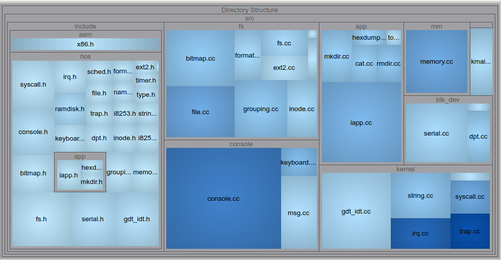
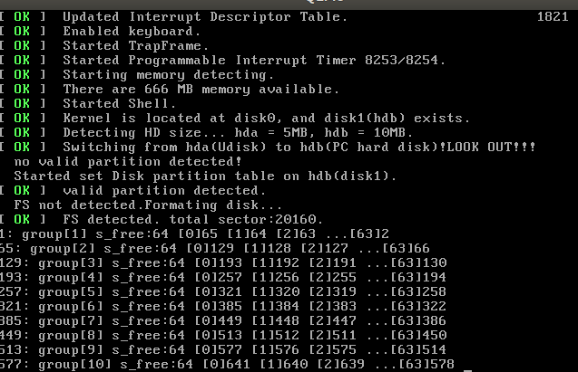
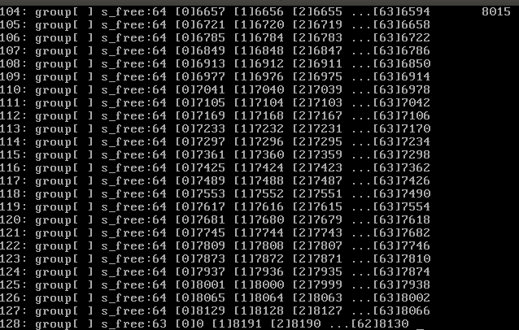

RiOS kernel
============

##### Copyright (C) 2018 Frank Curie (邱日)

------------------

19215116 邱日　指导老师:姜海燕
摘要:
关键字:位图、成组链接、多级索引、文件系统

----------------------

## 一、目的及意义


----------------------

## 二、课程设计思路及完成任务与功能说明

----------------------

## 三、裸机硬件部件

### 3_1.门描述符　Gate_descriptor

```C++
#pragma pack(1)
struct GATE_DESCRPTER{
	u16 offset_lowerbits		:16; // offset bits 0..15
	u16 selector			    :16; // a code segment selector in GDT or LDT
	u8  zero			        :8 ; // unused,set to 0     
	u8  seg_type			:4 ; // type and attributes, total u8 type_attr;
	u8  storage			    :1 ; // set to 0 for interrupt and trap gates 
	u8  descr_privilege_level   :2 ;
	u8  present			        :1 ;
	u16	offset_higherbits	:16; // offset bits 16..31	
};
#pragma pack()
```

这里门描述符应该逐字节紧凑排列，不能因编译器字节对齐而使结构体大小膨胀

### 3_2.异常和中断

| 中断向量  | 异常                  |
| ----- | ------------------- |
| 00    | 除零错                 |
| 01    | 调试异常                |
| 02    | 不可屏蔽中断(NMI)         |
| 03    | 断电(INT 3指令)         |
| 04    | 上溢出(INTO指令)         |
| 05    | 边界检查(BOUND指令)       |
| 06    | 无效操作码               |
| 07    | 无协处理器               |
| 08    | 双重错误                |
| 09    | 协处理器段超限             |
| 0A    | 无效的TSS              |
| 0B    | 段不存在                |
| 0C    | 栈异常                 |
| 0D    | 一般保护错（Windows下则是蓝屏） |
| 0E    | 页错误                 |
| 0F    | Intel保留             |
| 10    | 协处理器错               |
| 11-19 | Intel保留             |
| 1A-FF | 未用                  |

| IRQ脚  | 中断向量 | 中断       |
| ----- | ---- | -------- |
| IRQ0  | 08   | 系统时钟     |
| IRQ1  | 09   | 键盘       |
| IRQ2  | 0A   | 桥连到PIC2  |
| IRQ3  | 0B   | COM2     |
| IRQ4  | 0C   | COM1     |
| IRQ5  | 0D   | LPT2     |
| IRQ6  | 0E   | 软驱       |
| IRQ7  | 0F   | LPT1     |
| IRQ8  | 70   | CMOS实时时钟 |
| IRQ9  | 71   |          |
| IRQ10 | 72   |          |
| IRQ11 | 73   |          |
| IRQ12 | 74   | PS/2鼠标   |
| IRQ13 | 75   | 数学协处理器   |
| IRQ14 | 76   | 硬盘IDE0   |
| IRQ15 | 77   | 硬盘IDE1   |

### 3_3.


----------------------

## 四、通用数据结构设计（包括基础操作）

### 4_1.内存超级块结构        superblock

### 

```C++
struct super_block{
	u16 s_ninodes;
	u16 s_capacity_blks;		/*capacity count in blocks*/
	u16 s_startsect;
	u16 s_zone_bitmap_blks;		/*according to Prof Jiang,we will not use this policy (data block bitmap) anymore.*/
	u16 s_inode_bitmap_blks;	/*num of blks that bitmap takes up*/
	u16 s_inode_blks;
	u16 s_firstdatazone;		/*first data zone locates at which sector*/
	u16 s_specific_blk_nr;	    /*free space management:grouping, the specific block's block number,coounting from 1*/
/*成组链接专用块对应磁盘上的盘块号(从1计数)*/
	u16 s_magic;		    	/*ri_fs magic:0x88*/
/*These are only in memeory*/
/*code here.addtional info in memory*/
};
```


### 4_2.磁盘超级块结构       d_superblock

### 

```C++
struct d_super_block
{
	u16 s_ninodes;
	u16 s_capacity_blks;		/*capacity count in blocks*/
	u16 s_startsect;		/*超级块的起始扇区，sector0为boot sector,故超级块从1开始*/
	u16 s_zone_bitmap_blks;		/*according to Prof Jiang,we will not use this policy (data block bitmap) anymore.*/
	u16 s_inode_bitmap_blks;	/*num of blks that bitmap takes up*/
	u16 s_inode_blks;
	u16 s_firstdatazone;
	u16 s_specific_blk_nr_group;	/*成组链接专用块对应磁盘上的组号*/
	u16 s_magic;			/*ri_fs magic:0x88*/
};
```

超级块的s_magic为rifs文件系统的魔幻数字，这里我设其为0x88,开机时若在磁盘上超级块对应位置探测到0x88,系统就认为已经安装rifs文件系统．

### 4_3.内存中inode结构    m_inode

### 

```C++
struct m_inode
{
	u8 i_mode;			/*file type(dir/normal) and attribute(rwx)*/
	u8 i_size;
	u8 i_uid;			/*user id*/
	u8 i_gid;			/*group id*/
	u8 i_nlinks;			/*num of files that link to it*/
	u8 padding0;
	u32 i_creat_time;	
	u16 i_zone[10];
	u16 i_ino;			/*inode id号　(bitmap)*/
	u32 padding1[8];		/*占位　8*32个字节*/
/* ok,let's make sizeof(d_inode) exactly equal to 64,that's 512bits,
 * a sector can put exactly 8 of d_inode.
 * if we attemp to extend the m_inode and d_inode,make sure that
 * they are in sync with each other,and adjust the fields and paddings
 * without changing the sizeof(d_inode)
 */
/*请控制好d_inode的大小以及与m_inode同步性．这里设置几个padding的意义在于占位，
 *我把d_inode 的大小控制在8*6+32+16*10+16+32*8=512 bits,这样一个扇区512*8=4096bits,
 *正好可以放８个d_inode,尽量避免跨扇区操作inode;
 */	
/*
 * zone[0~6]:	direct block 
 * zone[7]:	single indirect block
 * zone[8]:	double indirect block 
 * zone[9]:	trible indirect block
 */	
/*These are only in memeory*/
	u32 i_access_time;
	u8 i_mount;
	u8 i_dev;			/*hd0 or hd1*/
	u8 i_dirty;
	u8 i_updated;
	u8 i_count;			/*引用数*/
	struct task_struct *i_wait;	/*not implemented yet*/
}__attribute__((packed));		/*一定要加，不然字节对不齐，会多用空间*/
​```
```


### 4_4.磁盘inode结构        d_inode

### 

```C++
struct d_inode{
	u8 i_mode;			   /*file type(dir/normal) and attribute(rwx)*/
	u8 i_size;			   /*file size that counts in bytes*/
	u8 i_uid;			   /*user id*/
	u8 i_gid;			   /*group id*/
	u8 i_nlinks;		   /*num of files that link to it*/
	u8 padding0;
	u32 i_creat_time;	   /*time of creating this file*/
	u16 i_zone[10];		   /*三次索引*/
	u16 i_ino;			   /*inode id号*/
	u32 padding1[8];
}__attribute__((packed));  /*一定要加，不然字节对不齐，会多用空间*/
```

磁盘inode和内存inode的数据结构上相似，即内容上磁盘inode结构是内存inode结构的子集，内存inode不但要保存磁盘inode的所有信息，还要保存进程和系统运行中的相关信息．为避免操纵磁盘inode时跨扇区操作，这里我严格控制d_inode结构体的大小，为512bits，即64B,而一个扇区512B,恰好可以放8个磁盘inode,这里__attribute__((packed))很重要，如果不加的话，编译器为了字节对齐，一个结构体将使用多于64B的空间，这样将导致inode的存放很碎，操作出问题．机构体里的padding主要是为了占位，凑到恰好64B,日后若扩展d_inode时，就减少padding的数量，然后加上要增加的新项，保持sizeof(struct d_inode)不变．

### 4_5.目录项结构              dir_entry

### 

```C++
struct dir_entry{
	u32 inode;
	u8 name[MAX_NAME_LEN];
}__attribute__((packed));
```

这里目录项对应目录中的一条记录的结构，记录两项内容，一是inode号，二是文件或目录名字．

### 4_6.文件结构                  file

### 

```c++
struct file
{
	u8 f_mode;			        /*文件读写模式及权限管理*/
	u8 f_flags;
	u16 f_count;			    /*file引用次数*/
	struct m_inode * f_inode;	/*指向活动inode表中文件的inode*/
	u32 f_pos;
};
```


### 4_7.进程控制块              task_struct

### 

```c++
struct task_struct{
	u8 gid;
	u8 uid;
	struct m_inode * pwd;
	struct m_inode * root;
	struct file * filp[NR_OPEN];	/*　进程表项　*/
/* this is user-wide file table */	
};
```

进程PCB记录当前的组id和用户id,内存inode指针pwd指向当前目录的inode,内存inode指针指向当前根目录的inode,进程表项struct file * filp[NR_OPEN],为用户打开文件表．

### 4_8.活动inode表           active_inode_table

```c++
struct active_inode_table{
	struct m_inode inode_table[MAX_ACTIVE_INODE];
};
```

rifs文件系统中有三个重要的表:
(1)系统打开文件表:　

​	struct file file_table[NR_FILE];系统中仅有一份
(2)用户(进程)打开文件表:　

​	struct file * filp[NR_OPEN];包含于进程PCB之中，每个进程有一份

(3)活动inode表:	

```c++
struct active_inode_table{
	struct m_inode inode_table[MAX_ACTIVE_INODE];
};
```


这三个表中，活动inode表从磁盘上拷贝inode,另外由于表中结构体是struct m_inode，还存一些系统运行时的相关信息，比如内存m_inode中的i_count即被引用次数．系统打开文件表file_table其表中项的结构是file,file中包含指向m_inode的指针，即指向活动inode表的表项.用户打开文件表filp[NR_OPEN],其中表项的结构是* file,即文件的指针.文件描述符fd是filp[..]指针数组的index下标,fd可以看做file索引的索引．

### 4_9.磁盘块联合体 　　free_space_grouping_head

(基于空闲磁盘空间的成组链接方式)

```c++
union free_space_grouping_head {/*成组链接法，各组空闲块的头*/
	u16 bytes[512] = {0};/*占坑位　2 sectors*/
	struct {
		u16 s_free;
		u16 s_free_blk_nr[BLKS_PER_GROUP];/*[64]*/
	};
/*s_free_blk_nr[0] is next free group's nr*/
};
```

在rifs中，对于数据区，空闲磁盘空间管理采用成组链接方式，一个磁盘数据块有两个扇区，这里采用了联合体而不是结构体，意义主要在于占位，使得一个这样的联合体恰好1024B即两个扇区即一个数据块的大小，若此磁盘块为组里第一块，则它要记录整个组空闲块的信息，第一项s_free记录本组共有几个空闲块，其后的表项记录本组所有空闲块的块号，其中s_free_blk_nr[0]记录下一组的组号,若已经是最后一组，则s_free_blk_nr[0]=0,每次分配时s_free-=1,然后以s_free为数组下标，找到s_free_blk_nr[]相应的空闲块号，即为要分配的块号．若s_free-=1后为0时，找下一组调入专用块，到下一组去找空闲块.

----------------------

## 五、软件系统设计

包括系统类图、顺序图等。论述软件系统结构、所完成功能的具体实现流程，对应类、方法函数等，可用伪码并论述


​							RiOS系统模块结构图

模块功能大致是这样：src/kernel处理系统中异常、中断及调度等核心功能;blk_dev为字符设备驱动，处理ATA(也叫IDE)硬盘驱动，硬盘分区表的检测和写入等,完成了设备管理，为文件系统的实现提供基础;mm是内存管理，这里采用相对比较简单的连续内存分配;include文件夹下面是各个c++源文件的头文件，包括一些重要的宏定义以及对部分x86指令向上层的封装;fs为文件系统主要模块，完成了inode的位图分配回收和数据块的成组链接分配回收、超级块的管理、用户打开文件表和系统打开文件表及活动inode表之间的联系和管理等;app包括但不限于文件系统的一些命令的实现如mkdir、pwd、ls、touch、rmdir等的函数实现;


​					RiOS调用关系图						


​								RiOS代码目录结构图

```c
Comment Lines 991
Comment to Code Ratio 0.37
Declarative Statements 905
Executable Statements 1,376
Files 59
Functions 191
Inactive Lines 0
Lines 4,488
Preprocessor Lines 603
```

​					                	rios代码情况统计表


​						UML Class Diagram of RiOS kernel



​							RiOS　kernel 整体代码分布


​					RiOS文件系统部分代码分布情况


​								RiOS 文件系统部分函数调用关系图


----------------------

## 六、关键操作（方法）函数的实现

与第五部分有所对应，用带注释伪码论述

6_1成组链接

- 初始化时，若之前未初始化，先指定*第一组*的第一块为专用块，把此块复制到内存专用块中;
  如果已经初始化，从磁盘加载超级块到内存，得到专用块的块号．
- 所有组的第一块相互链接，类似一个顺序表，这些组的第一块第一项存空闲块计数，第二项存下一块的块号，
  当专用块用完时，它就指定它的下一块是专用块，并在超级块中更改专用块的块号．
- 组号写代码时从０开始编号，０到１２７

开始的几组

末尾的几组


注意，最后一组空闲块要少一个

### 


----------------------

## 七、实践体会与总结

　　感谢姜老师的耐心指导

----------------------

## 参考文献

- [1]Andrew S. Tanenbaum & Albert Woodhull, Operating Systems: Design and Implementation[M]
- [2]Silberschatz A.Operating Systems Concepts[M].9th ed.[s.l.]:John Wiley & Sons,2013.
- [3]Stalling W.Operating Systems:Internals and Design Principle[M].7th ed.
- [4]Tanenbaum A S.Modern Operating Systems[M].3rd ed. [s.l.]:Prentice Hall,2008.
- [5]赵炯 Linux内核完全注释修正版v3.0[M]
- [6]李善平、 刘文峰、王伟波、王焕龙、李程远《Linux内核2.4版源代码分析大全》2002年
- [7]Andrew S. Tanenbaum (荷) 陈向群, 马洪兵等译 现代操作系统[M]著
- [8]x86汇编语言从实模式到保护模式 李忠, 王晓波, 余洁著 电子工业出版社 2013.01
- [9]郑阿奇 孙承龙 Linux内核精析 [M]电子工业出版社,2013.02
- [10]蒲晓蓉 操作系统原理与Linux实例设计[M] 电子工业出版社,2014
- [11]于渊 Orange S：一个操作系统的实现[M]电子工业出版社 2009.6.1
- [12]William Stallings(美) Operating systems:internals and design principles精髓与设计原理[M]北京:电子工业出版社,2013.07

参考网络资源

- [1]Linus早期Linux内核源码（Linux0.11）https://github.com/yuanxinyu/Linux-0.11
- [2]国外用于教学目的的类Unix操作系统xv6源码(含文档)https://github.com/leenjewel/xv6_learn
- [3]xv6在Ubuntu上较容易编译的版本　https://github.com/Benezia/OS172_Ass3 
- [4]https://wiki.osdev.org/Main_Page
- [5]清华大学ucore实验及学堂在线相关资料https://github.com/chyyuu/ucore_os_lab
- [6]https://pdos.csail.mit.edu/6.828/2016/xv6.html
- [7]中文版xv6文档　https://github.com/ranxian/xv6-chinese
- [8]《X86汇编语言-从实模式到保护模式》书后配套代码https://github.com/lichuang/x86-asm-book-source
- [9]《ORANGE’S：一个操作系统的实现》书后源码https://github.com/wlmnzf/oranges
- [10]Makefile编写手册 GNU make manual https://www.gnu.org/software/make/manual/make.html
- [11]键盘扫描码相关:https://github.com/willdurand/willOS


